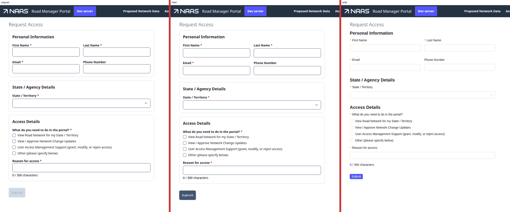
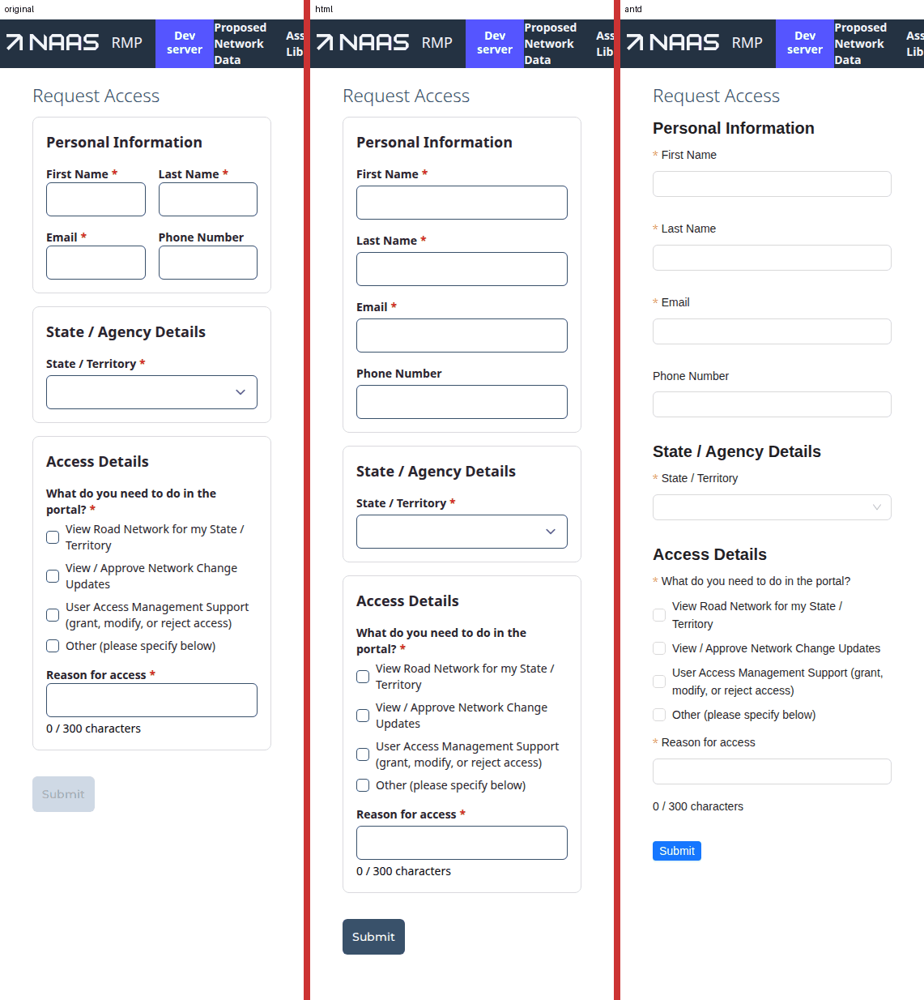
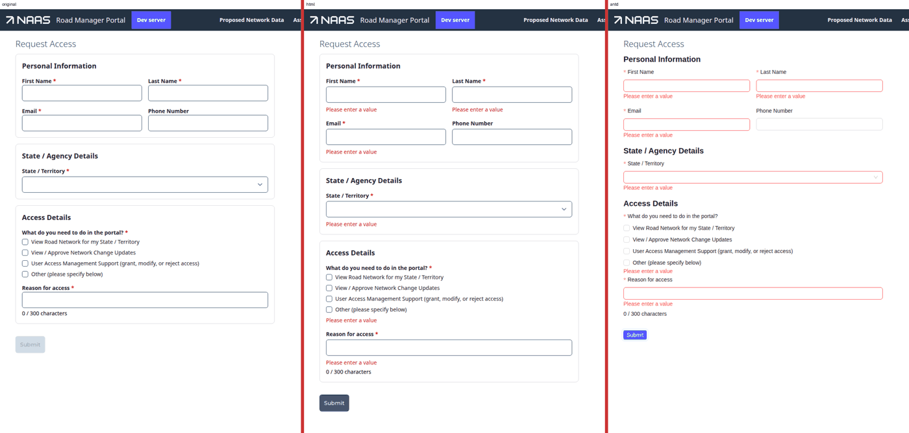
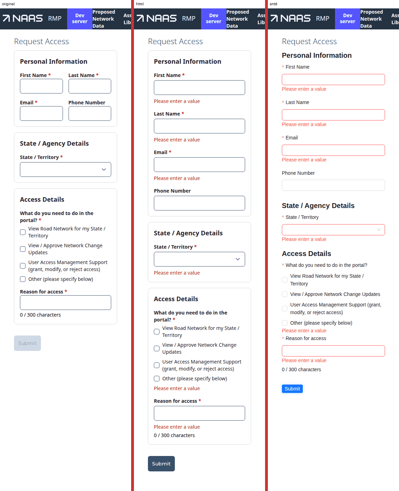
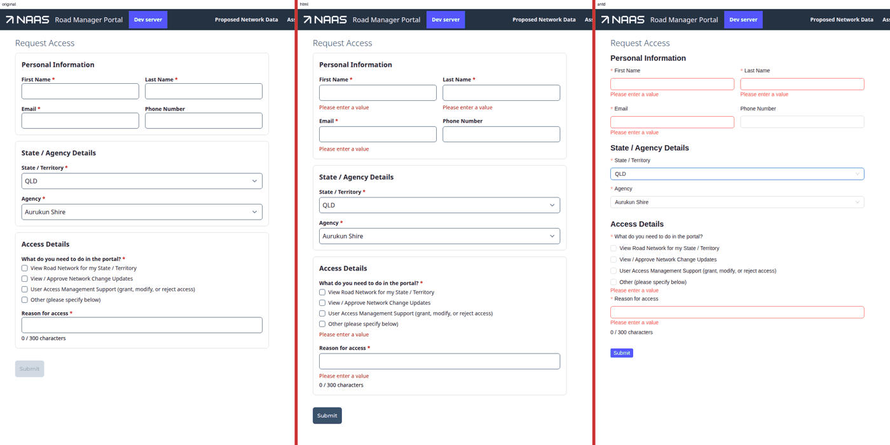
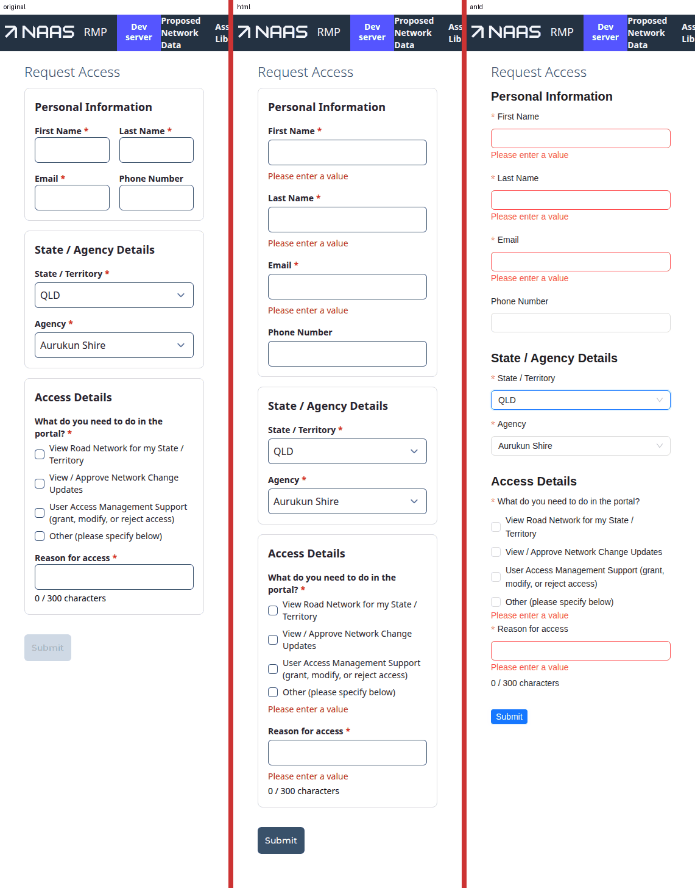
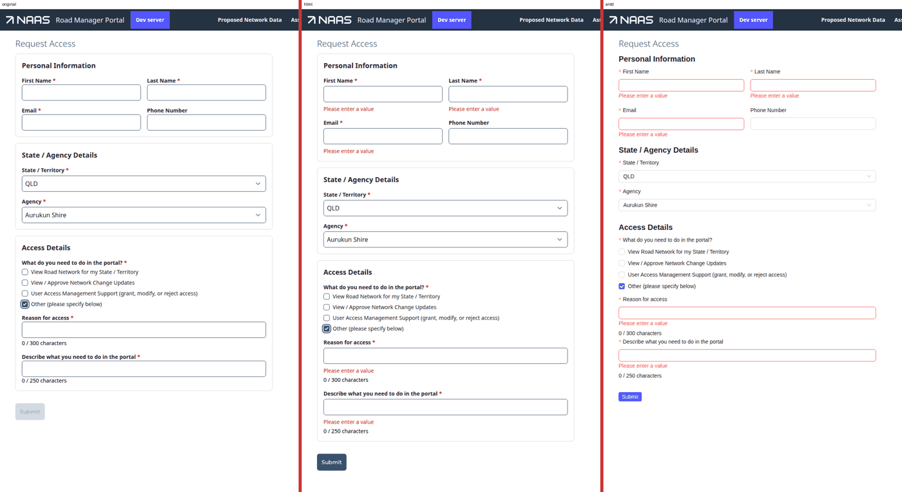
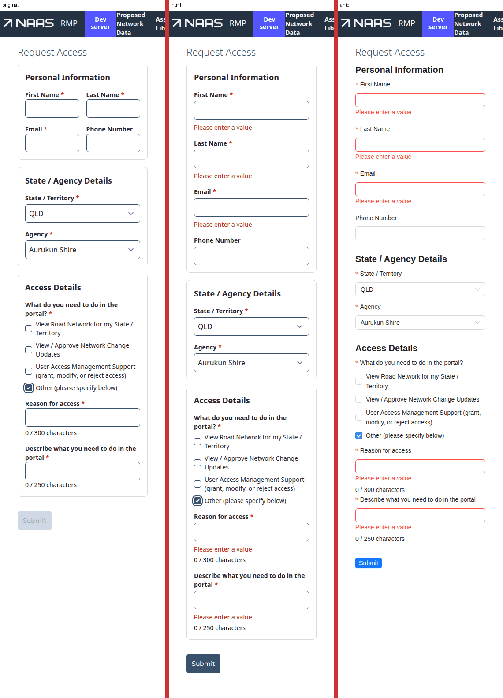
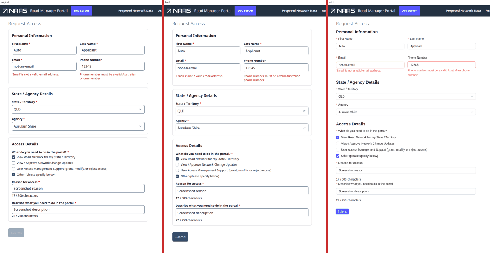
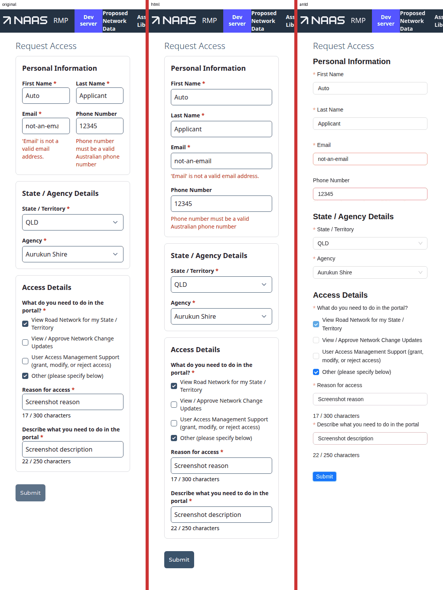

# Forms v2 — the HVAMS Request Access trial, `0.1.0-alpha.3`

The third cold-read conversion of HVAMS's public **Request Access** form (RMI `/requestAccess`),
against `@rx-controls/forms-{react,html,antd}@0.1.0-alpha.3` (rxc `3221d67`). This run has two
goals, in order: find where the contract does not fit a real form, and make the converted page
**look like the original** the way an adopter would, by styling the implementation and never the
form. The brief is [`FORMS-V2-HVAMS-TRIAL-BRIEF.md`](./FORMS-V2-HVAMS-TRIAL-BRIEF.md). Sections
1–6 were written before reading the previous reports. Section 7 compares against them.

**Verdict.** The form is written against the contract with **no effects and no custom widget**.
Agency reset, stale-agency clearing, the email prefill, the 300/250 caps, the "Other" clear-to-`null`,
Enter-to-submit, the gated submit and the live submit error each map to a contract prop. Every
check in the brief passes under html **and** Ant. Visual parity took a 126-line HVAMS module: a
theme overlay plus **three slot overrides**. Each override marks a place the theme cannot reach.
Most of the remaining findings are about the theme, or about how a group's layout classes meet
it, not about the contract's semantics.

Screenshots are in [`forms-v2-hvams-0.1.0-alpha.3/`](./forms-v2-hvams-0.1.0-alpha.3/). Each image
shows original | v2 html + HVAMS look | v2 Ant side by side.

---

## 0. What was built

| file (HVAMS `ClientApp/`) | what |
|---|---|
| `common/src/hvams/accessRequests/RequestAccessForm.tsx` | the form: `Form` / `Section` / `TextField` / `SelectField` / `TextDisplay` / `Action`, against compat `useControl` data |
| `common/src/hvams/accessRequests/AccessDetailsSection.tsx` | `Section` with `CheckListField`, two capped `TextField`s, counters, the "Other" region |
| `common/src/hvams/formsV2/HvamsFormLook.tsx` | **the HVAMS look**: `HtmlThemeProvider` (tailwind base + HVAMS overlay) + `FormRenderers` (3 slot overrides) |
| `sites/rmi/src/app/requestAccess/page.tsx` | `<FormProvider renderers={htmlRenderers}><HvamsFormLook>` around the form; the one place the implementation is chosen |
| `sites/rmi/src/app/requestAccessCompare/page.tsx` | temporary: original (restored from git) │ v2 html + look │ v2 Ant; `?v=` shows one |
| `common/src/hvams/accessRequests/ModifyAccessForm.tsx` | the second host of `AccessDetailsSection`: hosts the v2 section in a v2 island (see 1.7) |

The form files import only `@rx-controls/forms-react`, `@react-typed-forms/core` (compat) and
HVAMS non-UI code (`client`, `utils`, `naasSupport`, `next/navigation`). The only classes in them
are layout: `{ replace: "grid grid-cols-1 gap-4 sm:grid-cols-2" }` on the personal section,
`{ replace: "flex flex-col gap-1" }` on the field+counter regions, `my-4` on the Submit's shell,
`w-full max-w-2xl` on the submit error's shell, and plain-JSX page chrome. One exception is noted
in 1.8.

Brief requirements, and what each needed:

| requirement | written as | effect / widget? |
|---|---|---|
| keep compat data layer | `useControl<AccessRequestEdit \| null>()`, `form.fields.x` straight into v2 fields, no cast | no |
| autoComplete, required | `autoComplete="given-name"`, `required` | no |
| two to a row wide, one narrow | `Section className={{ replace: "grid grid-cols-1 gap-4 sm:grid-cols-2" }}` | no (see 1.1) |
| Agency hidden until a state | `hidden={(rc) => !rc.getValue(state)}` | no |
| agency → state's first on change | `restrictToOptions` (default) + `defaultValue={(rc) => agenciesOfState(rc)[0]}` | **no** (caveat in 3) |
| stale agency cleared | `restrictToOptions` (default) | **no** |
| email from `?email=` | `defaultValue={initialEmail}` | **no**; was a mount effect |
| 300 / 250 cap + error past it | `maxLength={300}`: caps the input and registers the `maxLength` rule (`forms-react/src/builtins.ts:44-61`) | no |
| "n / max" counter, red past max, not announced | `TextDisplay text={…} tone={(rc) => len > max ? "error" : undefined}` | no |
| description only with "Other", cleared to DTO's empty | `<Contents hidden={…}>` + `<Form clearHidden>` + `clearTo={null}` (`AccessRequestEdit.description: string \| null`) | **no**; was two effects |
| sections with titles | `Section title=…` → `role="heading" aria-level=2` | no |
| reasons → `AccessRequestReason[]` | `CheckListField` with `options` | **no widget** |
| submit only when valid; Enter submits | `<Form onSubmit validation>` + `<Action submit>`; html/Ant `form` slot | no |
| 400 / 409 / 429 handling | the original `submit()` body, unchanged except `isSubmitting` (the action's busy state replaces it) | no |
| submit error announced, counters not | `TextDisplay announce tone="error" hidden={…}` | no |

The one remaining `useEffect` loads the agency list from the server. It is data loading, not
form logic.

---

## 1. Gaps in the contract

### 1.1 A group's layout class merges into the theme's body layout — an author needs `{ replace }` and has to know the theme

`ContentsRegion` draws the body as `mergeClass(classes.body, className)`
(`forms-html/src/shared.tsx:151`). `tailwindHtmlTheme.contents.body` is
`"rxf-contents-body flex flex-col gap-4"` (`theme.tsx:471`). So the personal section's
`className="grid grid-cols-1 sm:grid-cols-2 gap-4"` becomes `flex flex-col gap-4 grid …`. Which
`display` wins then depends on where Tailwind emits `flex` and `grid`, not on the author. The
field+counter regions want `gap-1`, and get `gap-4 gap-1`, where `gap-4` wins on emission order.

What I did: `className={{ replace: "…" }}` on every layout group. That works, but the form now
encodes something about the theme: the author replaces *because* the theme body has a layout. A
theme whose body had none would make `replace` unnecessary, and one that adds a padding to the
body would see it silently dropped. §7 "Layout is classes" promises the author's class *is* the
layout. With a merge it is only an addition to the theme's layout.

**Want:** a body's *layout* to be the author's when the author gives one. Either the theme's
`contents.body` should carry no layout utilities (keep the flex default in a separate
`contents.defaultLayout` slot, applied only when `className` is absent), or `className` on a
group should replace rather than merge by default. Fields don't need this; groups do, because
for a group the class *is* the layout.

### 1.2 `tone` is a colour, but the theme can't tell an announced message from an inline colour

The submit error is `announce tone="error"`. The original draws it as a box
(`rounded bg-danger-100 text-danger-600 px-4 py-3`). The counter is `tone="error"` past its limit
and is red text with no box. The `tone` doc says as much: *a message box is a layout decision*
(`forms-react/src/display.tsx:337-341`). But the theme has one class per tone
(`displayShell.tones`, `theme.tsx:178-188`), so the box can't come from the theme. It can only
come from the author's `shellClassName` (styling in the form, against the rule) or from a slot
override.

What I did: a `text` slot override that adds the box when `p.announce && p.tone === "error"`
(`HvamsFormLook.tsx`). This keys appearance on an a11y flag. It works here, but `announce` means
"this changes and must be heard", not "draw a box".

**Want:** a presentation axis on displays separate from tone and from `announce`. For example a
theme slot `displayShell.message: Record<Tone, string>` applied to an announced display, or a
`TextDisplay` `variant: "message" | "inline"`. Then the box is the theme's and the form says only
what the thing is.

### 1.3 A section card needs a slot override: the theme has no per-kind group slots

HVAMS's `FormSection` is a bordered card (`border rounded-lg p-4`, title `text-lg font-bold`). The
form also uses plain `Contents` as invisible layout regions (field+counter, the "Other" region).
`GroupRenderProps.kind` tells them apart (`group.tsx`, `kind: "contents" | "section" | "inline"`).
But the html theme has one `contents` block (`theme.tsx:119-155`), so `contents.wrapper` would
border every invisible region as well.

What I did: the documented `FormRenderers` wrap (`registry.tsx:397-450`), adding the card classes
to `shellClassName` when `p.kind === "section"`. It's exactly the example in the `FormRenderers`
doc, and it worked first time. But it is plain theme data (a class per kind) dressed up as a
component.

**Want:** `contents.section: { wrapper, title, body }` (or a `kinds` map) in `HtmlTheme`, so a host
styles a section without writing a component. `kind` was added for exactly this. The theme should
consume it.

### 1.4 Transitions are a slot, not a theme setting

The original shows and hides Agency and the "Other" field instantly. forms-html's default
`visibility` is `FadeVisibility` (`html.tsx:825`, `shared.tsx:76-97`). It wraps every field in a
`div.rxf-fade` and holds a hidden field's last frame for 200ms. The theme can restyle that
wrapper (`visibility.fade`), but can't remove it or the 200ms hold. An empty fade class still
leaves the content on screen for 200ms after it is hidden.

What I did: `visibility: DefaultVisibility` in the slot overrides. Setting `transitions={false}`
on `<Form>` would also have worked, but that puts look in the form.

**Want:** either a theme flag (`visibility.transitions: false`), or accept this as the slot's job
and say so in the forms-html docs ("an app that wants no transitions sets `DefaultVisibility`").
Minor, and the override is one line.

### 1.5 A field revealed after a refused submit appears already in error

Refuse an empty submit, then tick "Other": the new description field appears already showing
"Please enter a value" (screenshot `desktop-4-other.png`). `touchAll` touches every registered
member (`validationScope.tsx:143-150`), including fields that are `hidden` at the time. They are
still registered, just not validating. A field the user has never seen is therefore marked
touched, and shows its error the moment it appears.

Arguably that's correct: the user did press Submit. The original never got here, because Submit
was disabled. But it differs from how a hidden *tab* behaves: its marker stays dark until the
user leaves it. **Want:** decide it explicitly. Either `touchAll` skips members whose presence is
`hidden`, or the docs state that a refused submit pre-touches hidden fields.

### 1.6 Nothing gives a host the DOM element of a field — focus or scroll to an error has no target

HVAMS's `applyValidationErrors` → `pathBasedErrors` (`@astroapps/client`) scrolls to and focuses
`control.element` of the first errored control, and sets `touched` on each one (which is why a
server error on a never-blurred field still shows; see 3). `@rx-controls/react`'s own inputs store
`control.meta.element` (`packages/react/src/ControlInput.tsx:47`). No forms-html or forms-antd
widget does, and `ControlSlotProps.ref` goes nowhere a host can read. `check()` refusing does not
focus the first invalid field either.

This is not a regression on this page: measured, the original leaves focus on `<body>` after a
400 too. But under v2 there's no way for a host to do it, short of querying the DOM by id. **Want:**
the frame's control ref, and every widget's focusable element, to publish `control.meta.element`
the way `@rx-controls/react` already does. Ideally also a `ValidationScope.check({ focus: true })`
that focuses the first invalid field it touched. On a long form, a refused submit with the first
error off-screen otherwise tells the user nothing.

### 1.7 The second host: a v2 section inside a legacy form needs its own provider stack

`AccessDetailsSection` is also rendered by `ModifyAccessForm` (the user-profile dialog), which is
a legacy form: `NTextfield`, a legacy `Select`, and a disabled-until-filled Submit. Decision: keep
**one** section, now v2, and host it in `ModifyAccessForm` as a v2 island:

```tsx
<FormProvider renderers={htmlRenderers}>
  <HvamsFormLook>
    <Form clearHidden>
      <AccessDetailsSection … />
    </Form>
  </HvamsFormLook>
</FormProvider>
```

It typechecks and builds. The dialog was not walked by hand: its spec fails on `develop` in the
shared DB anyway (see the trial memory). What it shows:

- **"The implementation is chosen in exactly one place" breaks under incremental adoption.**
  Every legacy host of a v2 piece picks the implementation and the look again, because
  `useRenderers` throws without a `FormProvider` (`registry.tsx:465-472`). The answer for HVAMS is a
  `FormProvider` + `HvamsFormLook` at the app root (`layout.tsx`). That is cheap, and the trial
  should probably have done it. Recommend the docs say so: the provider belongs at the app root,
  not the page.
- **A v2 section needs a `<Form>` to get `clearHidden`.** Without one it sits in the root scope
  (`clearHidden: false`, `scope.tsx:292-301`), so the "Other" field would not clear. The legacy
  host also cannot `check()` the island's validators: it has no handle unless it creates a
  `useFormValidation()` and passes it in. `ModifyAccessForm` keeps its own disabled-until-filled
  gating, so it doesn't need to. A host that wanted v2 validation from a legacy Submit would.
- The section's `description` binding is `Control<string | null | undefined>` and
  `ModifyAccessForm`'s is `Control<string>`. Compat's `Control` accepted the narrower one with no
  cast, as it did before.

### 1.8 Small

- **A ReactNode message carries a class.** The 409 message is JSX with an
  `<a className="underline font-medium">`. That is content, not a widget, but it is styling inside
  the form file. The html `text` slot has no slot for links inside text. Within reason. Noted
  because it is the one class in the form that is not layout.
- **Tailwind's content scan must include forms-html's `lib`.** The HVAMS overlay replaces most
  slots, but those it doesn't (e.g. `shell.horizontal`, the busy spinner) come from
  `tailwindHtmlTheme` and need `node_modules/@rx-controls/forms-html/lib/**/*.js` in the scan.
  This is documented (`theme.tsx:394-396`). It is easy to miss because nothing fails: the classes
  are just absent.
- **The check list exposes no invalid/required state.** `HtmlCheckList` puts the label and
  description on `role="group"` (`html.tsx:420-426`), but neither the group nor its checkboxes get
  `aria-invalid` / `aria-required`. The radio group gets both (`html.tsx:358-366`). ARIA does not
  allow those attributes on `group`, so the fix is on the checkboxes (or `aria-required` on the
  first). Measured in the DOM after a refused submit. The description is correct.

---

## 2. The multi-select: `CheckListField`

The contract provides it, so no widget was written:

```tsx
<CheckListField field={reasons} label="What do you need to do in the portal?" options={reasonOptions} required />
```

**Free:** the binding to `AccessRequestReason[]` (string enum values satisfy
`CheckListValue[]`), `required` refusing an empty array, the group's accessible name and
description (`getByRole("group", { name })` + `toHaveAccessibleDescription` pass under html and
Ant), touching on focus-leave rather than per box, and theming through `checkList.{className,
entry, input, label}`. Those four slots reproduce the original's checkbox list exactly.

**Awkward:** only the option shape. HVAMS keeps choices as `[value, label]` tuples
(`reasons.ts`), and they map once to `{ name, value }`. That's fine. **Want built in:** the ARIA
state in 1.8.

---

## 3. Validation and submit

**`check()`, `required`, `validate`, server errors.** They covered the real form.

- **Refused submit:** Submit or Enter on an empty form runs `check()`, which touches everything.
  Every required control then has "Please enter a value" as its accessible description: four
  textboxes, the State combobox, and the reasons group. Phone has none, and no POST goes out.
  Same under html and Ant.
- **Enter:** in a real browser, Enter in First Name on an empty form refuses with every error
  shown and no POST. Enter in "Reason for access" on a valid form posts **once** (counted by
  request listener) and reaches the success view. Both implementations draw the `form` slot.
- **Server 400:** an invalid email and phone come back on their fields, as the field's visible
  message *and* its accessible description. Editing Email clears its message. Both
  implementations.
- **Bare-function `validate={() => null}` on Email** (temporary), repeated: the server message
  still shows and still clears. The bare validator is keyed `default@<id>` and the server error
  stays under `default` (`fieldValidation.ts:62-93`). **Fixed and holding.**
- **A 400 on the focused, never-blurred field** (valid form; Enter pressed in Phone with
  "12345"): the message shows. This is only because HVAMS's `pathBasedErrors` sets `touched` on
  each errored control. `FieldRenderProps.error` is touch-gated (`field.tsx:336`), and `check()`
  touches nothing on a *valid* form (`validationScope.tsx:151-156`). So a host whose
  server-error helper does not touch would show nothing on that field. Worth one line in the
  `error` doc: a server error set by hand on an untouched field is not shown until the host
  touches it.
- **`applyValidationErrors` calls `control.clearErrors()` on the whole form first.** That also
  wipes the boundary-published rule errors (`required@…`, `maxLength`) from the *data* controls.
  Each is only republished when its validator next re-runs. Field display is unaffected, because
  display reads the boundary's verdict, which `clearErrors` doesn't touch (`fieldValidation.ts:150-154`).
  But `form.valid` on the data reads valid until then. Harmless here: a submit only reaches the
  server once `check()` passed. It is a trap for a host that clears errors and then reads data
  validity. From reading the source, not reproduced.

**Agency reset caveat.** `restrictToOptions` + `defaultValue` resets the agency only when the new
state's list *moves away* from it (`widgets.ts`, `restrictToOptions` doc). Measured: QLD → pick
Brisbane City → TAS gives "Break O Day Council", TAS's first, as the original did. Two states
sharing an agency would keep it, where the original reset to the first. HVAMS's lists don't
share agencies, so this was accepted. The doc states the caveat plainly.

**Announcements.** The submit error is the form's `role="alert"`. The 409 message, with its
"NAAS Support Centre" link, arrives in it. The counter has no `role` / `aria-live` on it or any
ancestor (asserted by XPath), so typing is not read out key by key. Under html and Ant.

**Visibility inside containers.** With First Name temporarily `hidden`, the personal grid's body
has three children and Last Name takes the first cell. There's no hole, under html (no wrapper
per field, `DefaultVisibility`) and under Ant. Nothing in the form needs a container to know which
children are hidden.

**Names.** Every textbox, both comboboxes and the reasons group pass `toHaveAccessibleName`;
section titles are `getByRole("heading")`. Both implementations.

**Console.** A scripted walk of every state under html and Ant (refused submit, state → agency →
another state, "Other" on / off / on, a server 400) logs **nothing** but the browser's own
`Failed to load resource: 400`. No React key, act or render-phase warnings.

**E2E.** `request-access.spec.ts` and `guest-routes.spec.ts` pass. The page object finds selects
by role and name. `nField`, which reached `NSelect` through its bare `<span>`, is no longer needed.
"Submit is disabled until…" became "an empty submit is refused with an error on each required
field". That step asserts each required control's accessible description and that no success view
appears. No assertion was weakened.

---

## 4. Visual parity

### The module

`HvamsFormLook.tsx`, **126 lines**: a ~70-line `PartialHtmlTheme` overlay on
`tailwindHtmlTheme`, three slot overrides, and the provider component. The page wraps the form in
it inside `FormProvider`. The classes were read from `@astrolabe/ui`'s `NTextfield` / `Textfield`
/ `NSelect` / `NField` / `Button` and HVAMS's `FormSection`, and none of those are imported.

**What the theme alone matched:**

- **Inputs and selects.** `frame.classNameOn: "input"` with the original's control classes
  (`rounded-md min-h-[36px] w-full border border-primary-500 px-2 bg-white`) on `frame.input`, and
  the frame reduced to `flex w-full`. HVAMS runs `@tailwindcss/forms`, whose `[type='text']`
  rules supply padding, font size and the focus ring. Putting the border on the input, as the
  original does, inherits all of that unchanged. Keeping tailwindHtmlTheme's border-on-frame
  would leave the plugin's ring and padding on the inner `<input>` as well (its `:focus` selector
  outranks a utility), drawing two boxes. That last part is predicted from selector specificity
  and was not rendered. **`classNameOn` is what made a forms-plugin app work in one slot.** That's
  the ServiceTas lesson applying to a second adopter.
- **Labels and required marker.** `font-bold text-sm`, marker `ml-1 text-danger-500 "*"`.
- **Errors.** `mt-1 text-sm text-danger-600`, after `gap-1`: the original Textfield's `mt-2`.
- **Checkbox list.** The four `checkList` slots.
- **Section titles.** `contents.title: "text-lg font-bold"`.
- **Counter.** `displayShell.display: "text-black"`, with `tones.error` red (it comes later in the CSS).
- **Button.** `action.className` + `variants.primary`: `Button`'s `default` size and variant.

**Each slot override, and why the theme couldn't do it:**

| override | why |
|---|---|
| `contents`: card classes when `kind === "section"` | no per-kind slots in the theme (1.3) |
| `text`: message box when `announce && tone === "error"` | a tone is one class; box vs inline colour is not expressible (1.2) |
| `visibility: DefaultVisibility` | the fade wrapper and 200ms hold are not theme data (1.4) |

### Side by side

Each image is original │ v2 html + HVAMS look │ v2 Ant. The header is unpinned for full-page capture.

| state | desktop (1280) | phone (375) |
|---|---|---|
| empty |  |  |
| refused submit |  |  |
| state + agency |  |  |
| "Other" ticked |  |  |
| server 400 (extra) |  |  |

"Refused submit" can't be produced on the original, because its Submit is disabled. Its column
in that row is the empty form. The server-400 row shows the original's error look for comparison.

### What still differs

| difference | kind |
|---|---|
| Submit is enabled on the empty form, where the original is disabled and greyed | **by design** (the brief replaces disabled-until-filled with a refused submit) |
| Errors appear on a refused submit; the original never showed client errors | by design |
| One column at 375px; the original is `grid-cols-2` at every width | **by the brief**; the original was not actually responsive |
| Label→control gap: 4px everywhere; the original is 0 for text fields and 4px for selects / the check list | **theme gap**: one `shell` for every widget. The original's own inconsistency, so within reason |
| Field+counter regions and section bodies are a few px taller in places, from the above gap | within reason |
| A field revealed after a refused submit shows its error (1.5) | contract question |
| The required marker is a real `aria-hidden` span, not a CSS `::after` | invisible; better a11y |

A user would not notice any of the remaining visual differences. Pixel-diffing was not attempted.

### Can another HVAMS form reuse it?

**As it stands, yes**, for forms built from text fields, selects, check lists, sections and one
primary button. It reads as HVAMS's form vocabulary, not this form's. Before a second form it
would need: radio and checkbox slots, which follow the same `NField` pattern but aren't set yet
(they would currently get tailwind's look); a `secondary` / `outline` button matching `Button`'s
variants beyond primary (secondary is set, the rest aren't); and the dialog slot for forms like
`ModifyAccessForm`. Move it to the app root with the `FormProvider` (1.7) and every v2 form gets it.

---

## 5. The swap: the unchanged form under `antdRenderers`

Mounted with `<FormProvider renderers={antdRenderers}>` and no HVAMS module, on the compare page.

**Same as html:** every check in section 3. That covers names, headings, the refused submit with
each required control's description, Enter refused when empty and posting once when valid, the
server 400 shown and cleared, the bare validator, the never-blurred field, `role="alert"` and the
silent counter, agency reset to TAS's first, "Other" clearing, the hidden-cell grid, and a clean
console. The author's layout classes (`{ replace: "grid … sm:grid-cols-2" }`) carried over,
because Ant's groups use the shared `ContentsRegion`.

**Different:**

| difference | verdict |
|---|---|
| Ant's own look: labels with a leading red `*`, Ant inputs, select and blue button; section titles in Ant's heading type | expected: parity is html's |
| No message box around the submit error: the box is the HVAMS `text` override | expected, and the reason it should be a theme concept (1.2) |
| Under an error, a field sits flush against the next item: check list error → "Reason for access", counter → "Describe…" | **implementation**: Ant's spacing is `Form.Item`'s bottom margin, which Ant removes while help shows, and the non-field children of a body (displays, nested `Contents`) get no gap. Ant's `contents` body needs a gap of its own, as html's theme gives it |
| Check list boxes get no invalid styling (inputs and select turn red) | implementation, minor; and see 1.8 for the ARIA half |

No contract gap was found by the swap. Everything that differed is the implementation's look.

---

## 6. Compat interop and the engine bump

- **The bump was already done.** `@react-typed-forms/core@5.1.2` (the latest, not deprecated)
  depends on `@rx-controls/core` / `react` `^1.1.2`, which is what alpha.3 needs. HVAMS `develop`
  already declares `^5.1.2` in all eight projects, and `@astrolabe/ui` declares
  `@rx-controls/react ^1.1.2` directly. Nothing to change.
- **Lockfile** after adding the three alpha packages and `antd@6.6.5`: exactly one
  `@rx-controls/core@1.1.2`, one `@rx-controls/react@1.1.2`, one `@react-typed-forms/core@5.1.2`.
- **Runtime:** `getCompatPatchInfo()` logged from the page:
  `{ packageCopies: 1, engineCopies: 1, duplicatePackage: false, duplicateEngine: false }`.
- **Interop:** compat `useControl` controls go straight into v2 fields with no casts, including
  `form.fields.x` of a `Control<AccessRequestEdit | null>` whose value starts `undefined`. Ambient
  `isSubmitted.value` in the form body (SWC plugin tracking) and v2's `rc` reads coexist. `tsc`
  is clean in `hvams-common` and `rmi`.
- **Builds:** see the end of this report.

---

## 7. Against the previous runs

Written after sections 1–6, which I wrote without opening either earlier report. The design docs
mention "decided after the HVAMS trial" in places (shell ids, `<Form onSubmit>`), so I knew
those areas had been visited before. I did not know the findings. Where a row below says
"re-checked", it was run again in this form after reading, not taken from the report.

### alpha.1's findings

| alpha.1 finding | status | in this real form |
|---|---|---|
| 1.1 check list touched as focus moves between its own boxes | fixed (`onFocusLeave`) | **Holds, re-checked**: empty the set, focus the next box: no error; focus leaves: error. html and Ant. The dialog flow it broke was not walked (1.7). |
| 1.2 `required` not exposed; marker in the name | fixed | **Holds.** `toHaveAccessibleName("First Name")` exact under both; `aria-required="true"` on the select. *But* the check list still exposes neither required nor invalid (1.8): alpha.1 put that down to ARIA forbidding both on `group`. The checkboxes can carry them. |
| 1.3 `announce` and `hidden` don't compose | fixed (`regionOnly`) | **Holds.** Written the natural way (`hidden={(rc) => !rc.getValue(submitError)}`). The empty `role="alert"` is in the page before any submit, and the 409 fills that node. |
| 1.4 reset is "move-away", not "on change" | documented | **Holds**; the caveat is in `restrictToOptions`' doc. Same data, same result (QLD → Brisbane City → TAS gives Break O Day Council). |
| 1.5 keyed `{ default }` swallows the server error | fixed (reserved) | **Holds, re-checked**: `validate={{ default: () => null }}` on Phone, Enter from Phone: message shown and described, html and Ant. The bare spelling holds too (3). |
| 1.6 server errors clear because core clears on write | documented | **Holds** (`field.tsx:178-182`). *Related, new:* the same doc should say an untouched field shows a hand-set error only once something touches it (3). |
| 1.7 `ReadContext` not exported | fixed | **Holds**; hvams-common needs no direct engine dependency. |
| §2 html draws two nested groups | fixed | **Holds**: `getByRole("group", { name })` resolves to exactly one, under both. |
| §3 a field revealed after a refused submit shows its error | **still open** | Still true, still undocumented. I found it again independently (1.5), with the cause: `touchAll` touches hidden members. |
| §3 a required select can be set back to empty | **still open** | html still draws the empty `<option>` on a required, defaulted Agency. Not re-reported in 1–6; the original did the same. |
| §4 Ant select has no `aria-invalid` | fixed | **Holds, re-checked**: `aria-invalid="true"` on Ant's State combobox after a refused submit. |
| §4 Ant has no group chrome; section titles unstyled | fixed (titles in Ant's heading type) | **Holds**: Ant's sections show Ant heading titles in the screenshots. Spacing under errors is still Ant's `Form.Item` margin only (5). |
| §5 stale engine `alpha` tags | fixed | **Holds**: `@rx-controls/core` has `latest: 1.1.2` only. |
| §5 second host needs its own `FormProvider` | noted, not a gap | **Same**, and that is what 1.7 recommends: put the provider at the app root. *Difference:* alpha.1 made `clearTo` a section prop because `ModifyAccessForm`'s model wants `""`. I hard-coded `null` in the section, which the modify DTO also accepts. So the dialog posts `null` where its model type says `string`. alpha.1's prop is the more honest choice. |
| `getByLabel(…, { exact: true })` trap | documented on `FieldProps.required` | **Avoided**: this run's specs use role + name throughout, and the page object's remaining non-exact `getByLabel` calls work. |

### alpha.0's findings (for history)

All resolved before alpha.1 and still resolved here: `maxLength`, options moving away from the
value, `clearTo`, form-level messages through `tone` / `announce`, layout as classes with hidden
children taking no cell (re-checked: the hidden-First-Name grid in 3), section headings,
`CheckListField` built in, the shell's label/error/help ids, the bare validator keyed per boundary,
`<Form onSubmit>` with Enter, and Ant's errors as accessible descriptions. Nothing from alpha.0 has
regressed.

### New in this run

The visual-parity half is new to this run, so most of these could not have been found before:

1. **A group's layout classes merge into the theme's body layout.** The author needs `{ replace }`
   and has to know what the theme does (1.1). This is the sharpest one: it undercuts "layout is
   classes", which alpha.0 and alpha.1 both relied on. They never ran a themed body.
2. **`tone` can't separate a message box from an inline colour**, so the box needs a slot override
   keyed on `announce` (1.2).
3. **The html theme has no per-kind group slots**, so a section card needs a `FormRenderers` wrap
   even though `kind` exists for exactly this (1.3).
4. **Transitions can't be turned off from the theme** (1.4). alpha.1 noted the 200ms hold. The
   new point is that it is not theme data.
5. **No widget publishes its element**, so host focus-or-scroll-to-error has no target, and
   `check()` doesn't focus either (1.6).
6. **A server error on an untouched field shows only because HVAMS's helper touches it** (3).
   alpha.1's server-error checks all went through fields the test had blurred.
7. **A host's root `clearErrors()` wipes boundary rule errors from the data** until each validator
   re-runs (3). From reading the source, not reproduced.
8. **The check list's checkboxes carry no `aria-invalid` / `aria-required`** (1.8). alpha.1 accepted
   "the group can't" and stopped there.
9. **Ant: no gap between a body's non-field children once an error shows** (5).
10. **For parity:** a `@tailwindcss/forms` app needs `frame.classNameOn: "input"` (it works); and
    forms-html's `lib` must be in Tailwind's content scan (4, 1.8).

## Suggested changes, in order

1. Make a group's author `className` *the* layout. The theme's body default should apply only
   when the author gives none (1.1).
2. Per-kind group slots in `HtmlTheme` (`contents.section`), and a theme home for an announced
   message's box (`displayShell.message`) (1.3, 1.2). With both, the HVAMS module would be a
   theme plus one line (`visibility`).
3. Publish `control.meta.element` from every widget; consider `check({ focus: true })` (1.6).
4. `aria-invalid` / `aria-required` on a check list's checkboxes (1.8).
5. Decide whether `touchAll` touches hidden members, and document it (1.5). Document that a
   hand-set error on an untouched field waits for a touch (3).
6. forms-antd: a gap in the `contents` body, so displays and nested regions are spaced while an
   error shows (5).
7. Docs: put the `FormProvider` and the app's look at the app root, not the page (1.7).

---

## Environment and verification

- HVAMS worktree off `develop` `06672c4b8`, uncommitted (the branch is throwaway). The develop
  backend ran from the worktree with the Autotest settings (`AppEnv__IsTestMode=true`,
  `PublicFormRateLimit__PermitLimit=60`). The rmi site ran on `:3001` under `rushx dev`.
- `rush build`: all 8 projects succeed (adf, admin, cop, formserver, hvams-common, roadmanager,
  roaduser; `@astrolabe/ui` from cache).
- `request-access.spec.ts` 2/2 and `guest-routes.spec.ts` 3/3 pass. One cold-compile timeout on
  the login page passed on rerun. The trial's own checks (names, headings, refused submit, Enter,
  server 400, focused-field 400, announcements, alpha.1 re-checks) pass 14/14 across html and
  Ant, and the walk logs no warnings.
- The side-by-side page is `/requestAccessCompare` (`?v=original|html|antd` for one column).
