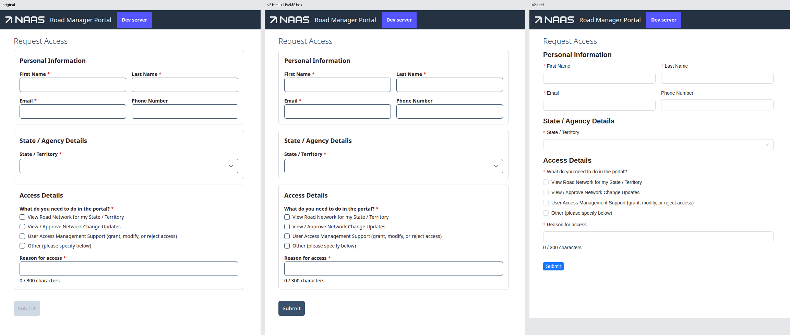
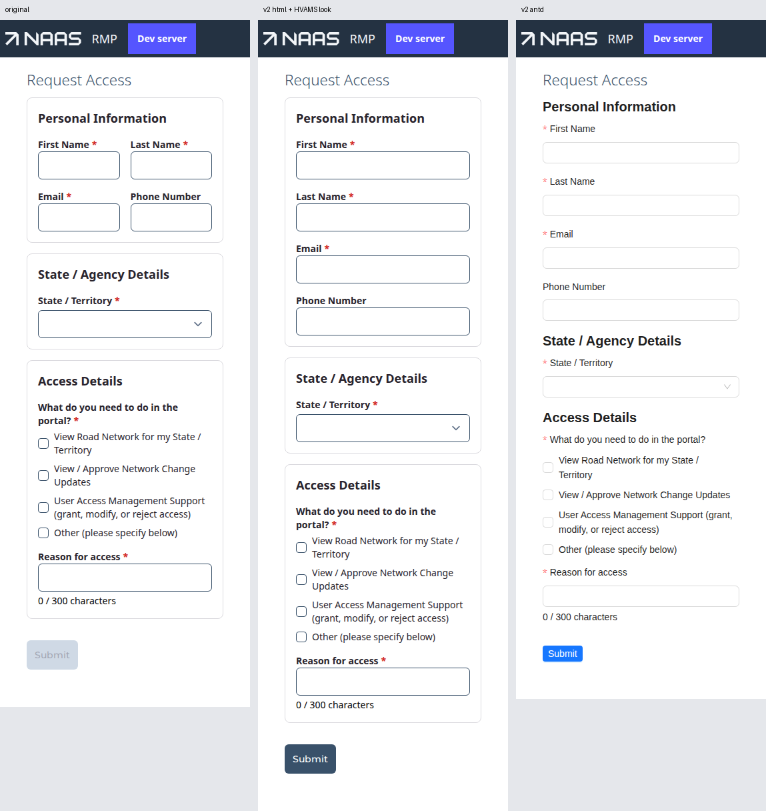
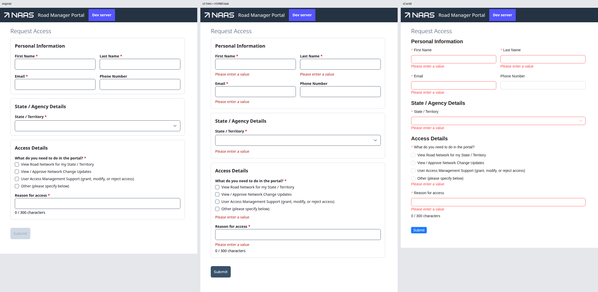
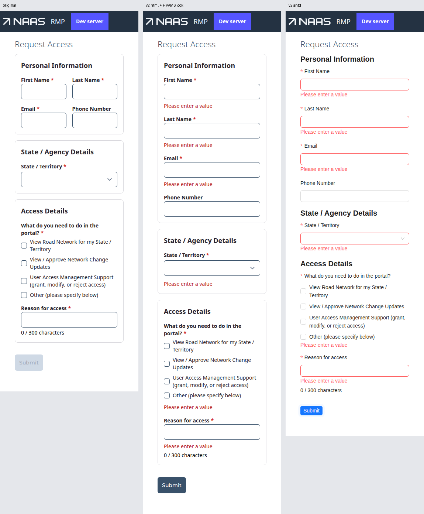
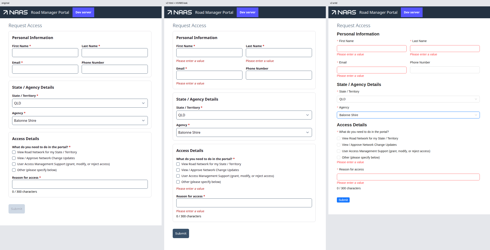
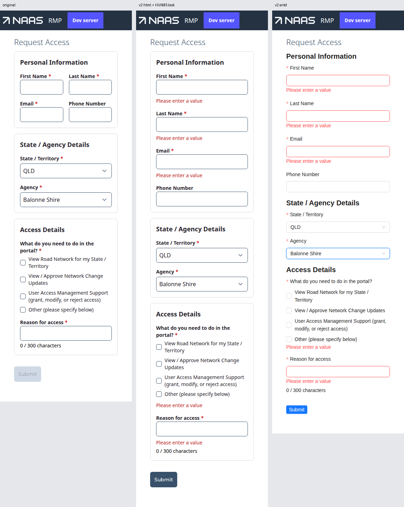
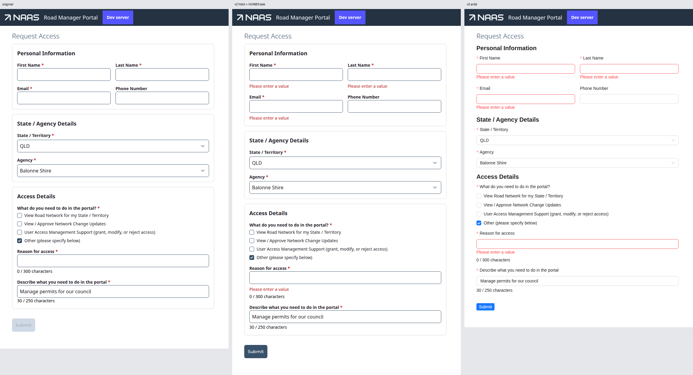
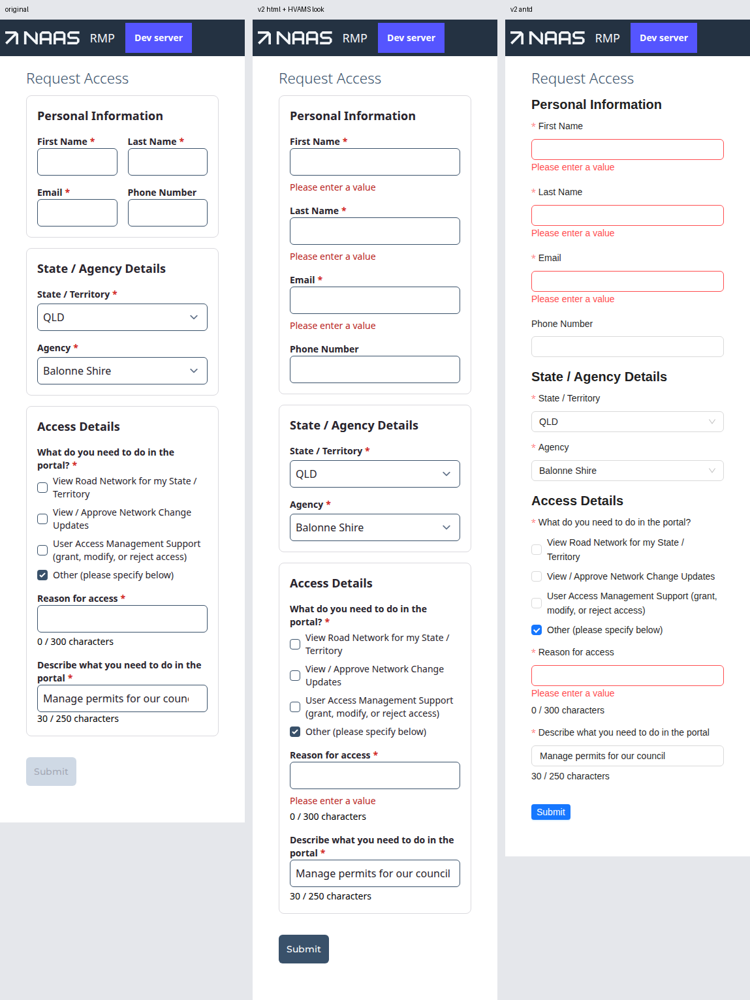

# Forms v2 — the HVAMS Request Access trial, `0.1.0-alpha.4`

The fourth cold-read conversion of HVAMS's RMI **Request Access** form, against
`@rx-controls/forms-react@0.1.0-alpha.4` (the `alpha` tag on 2026-10-05), drawn with
`forms-html@0.1.0-alpha.4` and swapped to `forms-antd@0.1.0-alpha.4` (`antd@6.6.5`). The brief is
[`FORMS-V2-HVAMS-TRIAL-BRIEF.md`](./FORMS-V2-HVAMS-TRIAL-BRIEF.md). Sections 1–6 were written
before the previous reports were opened; section 7 is the comparison.

Source lines cited are rxc at `bc90e91` ("Bump Forms v2 to 0.1.0-alpha.4"). HVAMS paths are
relative to `HVAMS.RoadManager.Server/ClientApp`. The HVAMS branch is throwaway.

**Verdict.** The form converts cleanly. Every requirement in the brief was met from the
contract with **no effect and no hand-written widget**; the only effect left is the data fetch
for the agency list. All seven behavioural checks pass identically under html and Ant, and the
console is clean under both. Visual parity under html was reached with a 152-line HVAMS module:
one theme overlay and two slot overrides. What is left is mostly about the theme's reach, not
the contract: per-widget shell classes, how a tone colour composes with a base colour, and a
character counter the contract has no place for.

## What was built

| file | what |
|---|---|
| `common/src/hvams/accessRequests/RequestAccessForm.tsx` | the form, v2 (206 lines; was 254) |
| `common/src/hvams/accessRequests/AccessDetailsSection.tsx` | the shared section, v2 (79; was 90) |
| `common/src/hvams/accessRequests/ModifyAccessForm.tsx` | second host: wraps the v2 section in `<Form clearHidden>` |
| `common/src/hvams/formsV2/HvamsFormLook.tsx` | the HVAMS look: theme overlay + 2 `FormRenderers` overrides |
| `sites/rmi/src/app/requestAccess/page.tsx` | `FormProvider htmlRenderers` → `HvamsFormLook` → form |
| `sites/rmi/src/app/userProfile/page.tsx` | the same two providers around `ModifyAccessForm` |
| scaffolding | `/requestAccessOriginal`, `/requestAccessAntd`, `/requestAccessCompare` (all three side by side), originals restored under `accessRequests/original/` |

The form files import only `@rx-controls/forms-react`, `@react-typed-forms/core`, HVAMS's API
client, `applyValidationErrors` and `next/navigation`. Nothing from `@astrolabe/ui` or an
implementation package. Classes in the form files are layout only: `grid grid-cols-1 gap-4
sm:grid-cols-2` on the personal-details `Section`, `flex flex-col gap-1` on the two
field-plus-counter `Contents`, `w-full max-w-2xl` / `my-4` as `shellClassName`s, and page-chrome
`div`s. The one exception is noted in G6.

**The second host.** `AccessDetailsSection` is also rendered by `ModifyAccessForm`, the
user-profile dialog. I converted the section once, in place, and made the dialog host it as a v2
island: `<Form clearHidden>` around the section inside the legacy dialog, with no `onSubmit`
(the dialog keeps its own legacy Submit and `submissionDisabled`). The user-profile page puts
the same `FormProvider` + `HvamsFormLook` around the dialog. `ModifyAccessForm`'s local form
type changed `description: string` to `string | null`, since the section now clears to `null`.
The `modify-access-request-submission` spec reaches the server from the dialog in every
submitting test. Its three submissions get 409s from requests already in flight in the shared
dev DB, which is a known failure on HEAD and unrelated. The other six tests pass.

## 1. Gaps in the contract

Requirement by requirement, what the contract offered:

| requirement | how | effect / widget? |
|---|---|---|
| keep compat `useControl` data | `form.fields.x` passed straight to `field=` | no cast |
| `autoComplete`, `required` | `TextFieldExtra.autoComplete`, `required` | — |
| State / Agency selects | `SelectField` with `options` as `(rc) => …` | — |
| Agency hidden until a state | `hidden={(rc) => !rc.getValue(state)}` | — |
| two to a row, one when narrow | `className` on the `Section` body, `transitions={false}` | — |
| reason / description stop at 300 / 250 | `maxLength` (`builtins.ts:49–60`, `widgets.ts:38`) | — |
| error if a longer value arrives | the same prop's implied rule, keyed `maxLength` | — |
| "n / max characters", red past the limit | `TextDisplay` with derived `text` and `tone` | — (but see G1) |
| description only with "Other" | `<Contents hidden={…}>` around field + counter | — |
| …cleared to the DTO's empty | `<Form clearHidden>` + `clearTo={null}` (`field.tsx:94`) | — |
| sections with titles | `Section title` → `role="heading"` `aria-level=2` | — |
| reasons as `AccessRequestReason[]` | `CheckListField` (`builtins.ts:117`) | — |
| submit only when valid | `<Form onSubmit>` + `<Action submit>` | — |
| Enter submits | the `form` slot (`shared.tsx:54`) | — |
| 400 / 409 / 429 handling, unchanged | the handler body is the original's | — |
| submit error announced, counters not | `TextDisplay announce tone="error"`; counters plain | — |
| agency resets to first on state change | `restrictToOptions` (default) + `defaultValue={(rc) => first}` | **no effect** (G2) |
| agency not in options cleared | `restrictToOptions` | no effect |
| email from `?email=` | `defaultValue={initialEmail}` | **no effect** |
| agencies loaded from the server | `useEffect` + `getAgencies()` | the one effect left |

The original had four `useControlEffect`s and a `useEffect` for the email. Three became props
and the description clearing became `clearHidden`. `submissionDisabled` (a hand-kept mirror of
`required`) and `isSubmitting` are gone: `check()` and the action's busy state replace them.

### G1. A character counter has nowhere to live on the field

The counter is a sibling `TextDisplay` (`AccessDetailsSection.tsx`, `CharacterCount`). The
contract gets it most of the way: `text` and `tone` are derived (`display.tsx:50`), red past the
limit costs one line, and it is not a live region unless asked (`display.tsx:66`), which is what
the brief wants. But it is not *part of the field*:

- it is not in the input's `aria-describedby`, so a screen-reader user hears the limit nowhere
  until they hit it (the original had the same gap, so this is parity, not regression);
- `helpText` cannot carry it: html drops help while an error shows (`html.tsx:124`), and help has
  no `tone`;
- the author needs a `Contents` with layout classes just to keep the counter 4px from its input.

And the field already knows the limit: `maxLength` is a contract prop, so the boundary has
everything a counter needs. **What the library should offer:** `showCount?: FormProp<boolean>`
on `TextFieldExtra`, drawn by the implementation inside the shell, described by the field, toned
by the shell's own invalid state. Ant has exactly this (`Input` `count`), and html can draw it
beside help. Until then the sibling display is fine.

### G2. "Reset on every change" is right here only because of the data

`restrictToOptions` clears the agency when the option list *moves away from it*, and
`defaultValue` then writes the new state's first agency. That matches the original's effect
(`agency = agencies[0]` on every state change) only when no agency appears under two states.
The doc says so plainly (`widgets.ts:107–113`). I checked the live list: QLD has 100 agencies,
TAS 31, and none are shared, so there is no effect. If an agency is ever added under two states,
switching between them keeps it, where the original reset it. That is arguably better behaviour,
but it is a behaviour that hangs on data, not on the form. **What the library could offer:** a
way to say what `defaultValue` depends on, e.g. `resetOn={(rc) => rc.getValue(state)}`, which
writes the default when that value changes and not only when the field is `undefined`. Low
priority.

### G3. Layout by classes worked, including a hidden cell

The personal fields are a CSS grid on the `Section`'s `className`. With Last Name hidden
(temporarily, by `hidden`), Email moves up into row 1, column 2 under html *and* Ant
(`forms-v2-hvams-0.1.0-alpha.4/hidden-cell-html.png`: First Name and Email both at y=197). No
container needed to know which children are hidden. The one thing the author has to know is
`transitions={false}` on a grid body, so no fade wrapper sits in a cell. With the HVAMS theme it
is moot (`visibility.transitions: false`), but the form cannot see the theme, so it is on the
form. That is right, and the doc says so (§7, "Layout is classes").

### G4. Host error-clearing reaches the framework's keys on the data (by reading; unreachable here)

`applyValidationErrors` starts with `control.clearErrors()` over the whole form, which also
removes the rule errors a boundary published onto the *data* controls (`required@<id>`,
`maxLength`). *Corrected after reading the source closely, when alpha.3's report disagreed with
my first draft:* each rule publishes to the data control **and** to the boundary's own verdict
control (`fieldValidation.ts:150–154`), and the field displays the verdict, so the error stays on
screen. What goes stale is the data's own validity: `form.valid` reads true until each validator
re-runs. In this form it cannot matter, because `onSubmit` runs only after `check()` passes. A
host that clears errors and then reads data validity (a core-only submit) would be misled.
**What the library should offer:** a line in the `FieldRenderProps.error` doc next to the
server-error note: a host clears its own keys (`setError("default", null)`), not all errors.

### G5. A button outside any `<Form>` just works

The success view's "Return to Home" is an `<Action onClick>` with no `<Form>` around it: the
root scope is the default (`scope.tsx:302–313`), and a `submit` action would fall back to
`onClick` (`action.tsx:65`). Under both implementations it navigates, and the console is clean.
It still needs the `FormProvider`, which the page has anyway.

### G6. Content with markup in a message

The 409 message is a `ReactNode` with a link styled `underline font-medium`, passed as the
`TextDisplay`'s `text`. That is the only non-layout class in the form files. It is content (the
original's), and the contract rightly takes any node. A link display in the contract would be
the only way to keep even this out, and it is not worth one.

### G7. Where the implementation is chosen

The brief puts `FormProvider` on the page. The registry doc (`registry.tsx`, `FormProvider`)
recommends the app root, "so a v2 piece dropped into an existing page or a legacy form needs
nothing around it". The second host shows why: the user-profile page needed its own
`FormProvider` + `HvamsFormLook`, so the implementation is now chosen in two places. At the
root (`sites/rmi/src/app/layout.tsx`) it would be one, and the scaffolding pages could still
override it with a nested `FormProvider`. Not a contract gap; the brief and the doc disagree, and
the doc is right for an app with more than one v2 island.

## 2. The multi-select

`CheckListField` (`builtins.ts:117`, html `html.tsx:414`) is now built in, so there is no custom
widget this run.

**Came free:** binding `AccessRequestReason[]` with no conversion; `required` refusing an empty
array; a real `role="group"` named by the caption (`aria-labelledby`), so
`getByRole("group", { name: "What do you need to do in the portal?" })` works under html and
Ant; the required state described in words for assistive technology (`describeRequired`, since a
group cannot carry `aria-required`); the error in the group's description; `aria-invalid` on
each box; touch on leaving the group; ticks appended in order, unticks removing, other values
kept. Hidden-with-`clearHidden` would clear the array, not needed here.

**Awkward:** only that HVAMS keeps its options as `[value, label]` tuples, so one `map` to
`{ value, name }`. That is HVAMS's shape, not the contract's problem.

**What I'd want built in:** nothing further for this form.

## 3. Validation and submit

`check()`, `required`, `maxLength` and the server errors covered the real form with nothing
hand-written.

- **Refused empty submit:** every required field shows "Please enter a value" as its accessible
  **description** (textboxes, the State combobox, the reasons group); Phone has none; Agency is
  hidden, so it has no error and no control; **focus moves to First Name** (`focusInvalid`,
  `scope.tsx:199`); no POST; no success view. Under html and Ant.
- **Enter:** in First Name on an empty form, refused as above with no POST. In "Reason for
  access" on a valid form, it posts **exactly once**, and the success view shows. Under html and
  Ant.
- **Server 400:** with `not-an-email` and phone `12345`, Enter pressed *in the phone field* (one
  the user never left): both messages show and are the controls' accessible descriptions.
  `applyValidationErrors` touches what it sets (`pathBasedErrors`), which is what
  `FieldRenderProps.error`'s note asks of a host (`field.tsx:178–185`). Editing the phone clears
  its message and leaves Email's. **Repeated with `validate={() => null}` on Phone and
  `validate={{ default: () => null }}` on Email:** both server messages still show and clear the
  same way. The reserved `default` key holds (`field.tsx:127` doc).
- **The limits:** typing stops at 250; a 255-character value pushed past `maxlength` (native
  setter + `input` event) shows "At most 250 characters" on the field and turns the counter red.
- **Other on / off / on:** the description appears, clears when hidden and comes back empty; the
  POST carries `"description": null`, as the DTO wants.
- **State switch:** QLD → first agency; pick Balonne Shire; TAS → Break O Day Council (TAS's
  first); back to QLD → Aurukun Shire.
- **The 500 path:** the submit error is a `role="alert"` with the original's text.
- **Console:** nothing beyond the browser's own "Failed to load resource" for the deliberate
  400 / 500, under html and Ant. No key, act or render-phase warnings.

The real specs were updated, not weakened: `request-access.spec` now asserts that an empty
submit is refused with an accessible error on each required field, and that the server's
messages are the fields' accessible descriptions. The page object finds every control by role
and name; the `nField` helper the selects needed is gone, because the selects now have names.
`request-access.spec` and `guest-routes.spec` pass (5/5), including the `?email=` prefill from
the login page.

## 4. Visual parity

Screenshots, original | v2 html + HVAMS look | v2 Ant, full page, in
[`forms-v2-hvams-0.1.0-alpha.4/`](./forms-v2-hvams-0.1.0-alpha.4/):

| state | desktop (1280) | phone (375) |
|---|---|---|
| empty |  |  |
| refused submit |  |  |
| state + agency |  |  |
| "Other" ticked |  |  |

**The module.** `common/src/hvams/formsV2/HvamsFormLook.tsx`, 152 lines: `HtmlThemeProvider
tailwindHtmlTheme` → `HtmlThemeProvider hvamsHtmlTheme` (the overlay, about 70 lines of slots) →
`FormRenderers` with two overrides. The classes were read off `@astrolabe/ui`'s `NTextfield`,
`NSelect`, `NField`, `Textfield`, `Button` (`buttonVariants` default/default) and HVAMS's
`FormSection`; none of those components is imported.

**What the theme alone matched:** input and select (the border on the input, `rounded-md`,
`min-h-[36px]`, `border-primary-500`, `px-2`, `bg-white`); the focus ring and the select's
chevron, both from HVAMS's `@tailwindcss/forms` because `frame.classNameOn: "input"`
(`theme.tsx:80`) keeps the chrome on the native element the plugin styles; the label (bold), the
required marker (red `*`, `ml-1`, `aria-hidden`), the error (`text-sm text-danger-600`, `mt-2`);
the checkboxes (`h-4 w-4 rounded border-primary-500`) and their rows; the section card and its
title (`contents.section.*`, which only `kind: "section"` gets, so the plain `Contents` around
field + counter draw no card); the primary button (`buttonVariants` + `.btn`); the submit-error
box (`displayShell.message.error`); the counter colour and its red tone; show and hide at once
(`hideWith: "attribute"`, `visibility.transitions: false`).

**Slot overrides, and why the theme could not do them:**

1. **`select`** and 2. **`checkList`**: wrap the enclosing slot, adding `text-sm` to
   `labelTextClassName` and `gap-1` to `shellClassName`. The original's shells differ by widget:
   `Textfield` draws a 16px bold label flush on the input, while `NField` (behind `NSelect` and
   the hand-drawn checkbox group) draws a 14px label with a 4px gap. The theme's `shell` is one
   set of classes for every field (`theme.tsx:38`), and the shell is not told which widget it is
   drawing. **Theme gap**: a per-widget shell overlay (`select: { shell: {...} }`), or the widget
   key on `FieldShellProps` as a data attribute a class could target, would remove both
   overrides. The function form of `FormRenderers` (`registry.tsx:209–217`) made the overrides
   short: wrap `outer.select`, merge with `combineClass`, done.

**Awkward, and a finding each:**

- **Tone vs. base colour.** The tone colour is on the display's wrapper and *inherited*
  (`shared.tsx:390–396`). My first overlay put the counter's `text-black` on the text slot,
  which silently masked the red: the e2e check read `rgb(0,0,0)` at 255/250. It works with
  `text-black` on `displayShell.display`, beside the tone class, but then which wins is CSS order
  (danger comes after black in the palette). **Theme gap**: a base text colour that a tone
  *replaces* rather than competes with, i.e. tone classes applied instead of the base colour
  rather than as well as it.
- **Message vs. tone.** An announced error display gets `tones.error` *and* `message.error`
  (`shared.tsx:394`), so the box's `text-danger-600` competes with the tone's `text-danger-500`.
  I used `!text-danger-600`. Same fix as above: `message` should replace the tone's colour, not add
  to it.
- **Tailwind scan.** The host's Tailwind `content` needs
  `node_modules/@rx-controls/forms-html/lib/**/*.js` (added to `sites/rmi/tailwind.config.ts`),
  as the theme doc says. Easy to miss: without it, the page renders unstyled in places with no
  error.

**What still differs:**

| difference | why | verdict |
|---|---|---|
| at 375px the personal fields are one per row | the brief asks for that "as the original did", but the original is `grid-cols-2` at every width | brief, not parity |
| errors show at all | the original never shows client errors: Submit is disabled until filled, and `NSelect` drops `errorText` (so the selects and the checkbox group could not show one) | improvement, intended |
| Submit is enabled on an empty form | v2 refuses on click and shows the errors instead | intended (brief) |
| an extra `div` (the frame) around each input | `forms-html`'s frame always renders (§7) | within reason, invisible |
| section titles are `div role="heading"`, not `h2` | `shared.tsx:155` | within reason; same name, level and look |
| the 4px label gap on Select vs 0 on text inputs | reproduced deliberately, see the overrides | parity |

Nothing else a user would notice: type sizes, weights, colours, borders, radius, heights, focus
ring, spacing and section cards line up in all eight screenshots.

**Can another HVAMS form reuse the module?** Yes, as it stands, for any form made of text fields,
selects, check lists, checkboxes, sections and primary buttons, which is most of RMI's settings
and request forms. Not covered: radios, tabs, wizard, dialog, display-only, secondary/link
buttons beyond a guess. Those fall through to `tailwindHtmlTheme`'s blue/gray palette and would
need slots read off their `@astrolabe/ui` counterparts. It belongs at the app root of each site,
not per page (G7).

## 5. The swap

The unchanged form under `<FormProvider renderers={antdRenderers}>`, no HVAMS module
(`/requestAccessAntd`, and the third column of `/requestAccessCompare`).

**Behaviour:** identical. Every check in section 3 passes under Ant: names, headings, accessible
descriptions on refused submit and on server 400, focus to the first error, Enter refusing and
posting once, the bare-`validate` server-error check, the agency reset, Other on/off/on with
`null` posted, the cap and the over-limit rule, the red counter (`rgb(255,77,79)`, Ant's error
token), the `role="alert"`, the hidden grid cell, the success action. Console clean.

**Differences, all look, none behaviour, none contract gaps:**

- Ant's look: small regular-weight labels with the asterisk *before* them (Ant's convention), red
  borders on invalid inputs, Ant's own select, a small blue Submit.
- `Section`s draw no card under Ant: the title and body, no border. That is `forms-antd`'s
  `contents` choice, not the contract's. Ant has `Card`, and `kind: "section"` is there to use
  it. **Implementation choice**, worth reconsidering for parity with html's section slot.
- The selects are `role="combobox"` with a popup listbox rather than native `<select>`, so the
  trial's test helper picks options differently. That is test plumbing; the names and
  descriptions are the same through the accessibility tree.

## 6. Compat interop and the engine bump

- The alpha needs `@rx-controls/core` / `react` `^1.1.2`; compat `@react-typed-forms/core@5.1.2`
  depends on exactly those. **develop already declares `^5.1.2` everywhere** (cop, rui, rmi,
  formServer, admin, adf, common, astrolabe-ui), and `astrolabe-ui`'s direct
  `@rx-controls/react ^1.1.2` matches, so **no bump was needed this run**.
- After `rush update` with the three alpha packages added (forms-react + forms-html to `common`;
  those plus forms-antd and `antd@^6.6.5` to rmi), the lockfile has exactly one
  `@rx-controls/core@1.1.2`, one `@rx-controls/react@1.1.2` and one compat `5.1.2`, none
  deprecated. At runtime the page logged
  `getCompatPatchInfo() → { packageCopies: 1, engineCopies: 1, duplicatePackage: false, duplicateEngine: false }`.
- Compat controls go straight into v2: `form.fields.x` from a compat
  `useControl<AccessRequestEdit | null>()` typechecks as every `field=` and `FormProp` with no
  cast, including the `Control<ReactNode>` passed as a `TextDisplay`'s `text`. The SWC tracking
  plugin's ambient reads (`isSubmitted.value` in render) and v2's `rc` reads coexist in one
  component without warnings.
- All eight workspace projects build (`rush rebuild`: @astrolabe/ui, hvams-common, adf,
  formserver, cop, admin, roaduser, roadmanager).

## 7. Against the previous runs

Written after sections 1–6. Three reports precede this one: alpha.0
([`FORMS-V2-HVAMS-REQUEST-ACCESS.md`](./FORMS-V2-HVAMS-REQUEST-ACCESS.md)), alpha.1 (with an
alpha.2 check at its end), and **alpha.3**
([`FORMS-V2-HVAMS-REQUEST-ACCESS-0.1.0-alpha.3.md`](./FORMS-V2-HVAMS-REQUEST-ACCESS-0.1.0-alpha.3.md)),
the first run with visual parity. The brief names alpha.1 as "the previous run", but alpha.3 is
this run's direct predecessor, and alpha.4 is the release made from its "After the trial" list.
So alpha.3 is the main comparison. alpha.3's report already re-checks every alpha.1 finding.
Rows marked **re-checked** were run again in this form after reading. The rest are from sections
1–6, or say "by reading".

One correction came out of the reading: my first G4 said a host `clearErrors()` would hide a
failing rule from the field. alpha.3 read it right: display reads the boundary's verdict, which
the clear does not touch. G4 is fixed above.

### alpha.3's fixes (what alpha.4 shipped)

alpha.3 ended predicting that "the HVAMS look should be a theme with no slot overrides". It is
now a theme with **two**. Both are the per-widget shell difference (label size, label gap)
that alpha.3 measured and accepted as "within reason" (its §4 table, "Label→control gap"). I
reproduced that difference rather than accepting it. Everything alpha.3 needed an override for
is now theme data.

| alpha.3 finding | alpha.4 | in this real form |
|---|---|---|
| 1.1 a group's layout class merges into the theme's body layout; author needs `{ replace }` | `contents.layout` applies only without an author `className` (`shared.tsx:145–147`) | **Holds.** I wrote plain `className="grid … sm:grid-cols-2"` and `"flex flex-col gap-1"`, never knowing `{ replace }` had been needed, and they lay out correctly under html and Ant. |
| 1.2 no theme home for a message box | `displayShell.message` (`theme.tsx:229`) | **Holds, with a residue.** The box is pure theme now. But `message` is *added to* `tones.error` (`shared.tsx:394`), so the box's text colour fights the tone's. I needed `!text-danger-600` (§4). New. |
| 1.3 no per-kind group slots | `contents.section` | **Holds.** The card is three theme strings, and plain `Contents` draw no card. |
| 1.4 transitions are a slot | `visibility.transitions` | **Holds.** One theme flag; no `visibility` override. |
| 1.5 a field revealed after a refused submit shows its error | `touchAll` passes hidden fields | **Holds, re-checked**: refuse empty, then tick Other. The description appears with no error; the next Submit shows one. html and Ant. |
| 1.6 no element; `check()` doesn't focus | `elementRef` / `control.meta.element`; `focusInvalid` | **Focus holds** (§3: First Name is focused after a refused submit, under both). `control.meta.element` itself not checked. |
| 1.7 provider per host; docs should say app root | documented on `FormProvider` | **Holds as documentation.** The brief still says "the page", and this run followed the brief, so the second host chose the implementation again (G7). The brief should change. |
| 1.8 check list carries no `aria-invalid` / required | each checkbox `aria-invalid`; `describeRequired` | **Holds, re-checked**: after a refused submit the first checkbox has `aria-invalid="true"` under html and Ant, and the group's description includes the required note plus the error. |
| 1.8 Tailwind content scan | documented | Still easy to miss; I added it before looking, from the theme doc. Same finding, now with no surprise. |
| §3 required select can return to empty | empty choice dropped once a value exists | **Holds, re-checked**: no empty `<option>` on Agency once it has a value (html). Ant's clear is gated the same way (`antd.tsx:671`, by reading). |
| §3 an untouched field's server error | documented (`field.tsx:178–185`) | **Holds.** Enter in the never-left Phone field shows its server message, because HVAMS's helper touches it, as the doc now says. |
| §3 host `clearErrors()` wipes rule errors from the data | not changed | **Still open, by reading** (G4). Agreed with alpha.3, after my correction. |
| §5 Ant flush under an error | the body is token-spaced, shells have no margin | **Holds**: the Ant refused-submit screenshots show the check list's error and the counter spaced from what follows. |
| §5 Ant draws sections as plain title + body | not changed | **Still so** (§5). Ant has `Card`; worth it for parity with html's section slot. |
| 1.7 the dialog was not walked | — | **Walked this run**: the modify-access spec's six non-submitting tests pass and every submit reaches the server from the dialog (409s from the shared DB). |
| alpha.1's `clearTo` as a section prop | — | Same choice as alpha.3: `null` hard-coded in the section. I changed `ModifyAccessForm`'s model type to `string \| null` so the types say what is posted. alpha.1's prop is still the more general answer for two hosts with different DTOs. |

### alpha.1 (and its alpha.2 check)

All of alpha.1's findings were fixed by alpha.2, and alpha.3 re-checked them. In this run:
`required` reaches assistive technology and the marker stays out of the name (every control
found by exact role + name, under both); `announce` composes with `hidden` (the submit error is
written with `hidden`, and the alert is announced); a keyed `{ default }` validator no longer
swallows the server error (**re-checked**, §3); `ReadContext` is exported (imported from
forms-react throughout); html draws one check-list group; Ant's select has `aria-invalid`; the
engine has one copy. alpha.1's 1.1 (check list touched on internal focus moves) was found
through the modify dialog. That dialog's checkbox steps pass in this run, which is the same
evidence alpha.2's check used. The 1.4 caveat ("reset" means move-away) is documented and is my
G2; I add a suggested `resetOn`, and I checked the live data (no shared agencies).

### alpha.0 (history)

Its seven suggestions (per-boundary keys for bare validators, shell-owned ids for Ant,
`maxLength`, options reconciling the value, hidden tabs/pages and column layout, a built-in
multi-select, `<Form>`-owned submission with a toned message and a chosen `clearHidden` value) are
all in the contract, and every one that this form touches was used in sections 1–3 without a
workaround. Nothing has regressed.

### New in this run

1. **A character counter has no home on the field** (G1). Every run wrote the sibling
   `TextDisplay` and found it fine. The gaps only show when you ask whether it belongs to the
   field: it is not in `aria-describedby`, `helpText` can't carry it, and the field already has
   `maxLength`. Suggest `showCount`.
2. **A colour on the text slot silently masks the tone** (§4). I caused it and the e2e colour
   check caught it. A theme author will hit this with any base text colour. Tones should
   replace a base colour, not compete with it.
3. **`message` adds to the tone instead of replacing its colour** (§4), only reachable now that
   `message` exists.
4. **The per-widget shell is the last thing needing an override** (§4). alpha.3 saw the
   difference and accepted it. Reproducing it needs either per-widget shell slots in
   `HtmlTheme`, or the widget's key on the shell (a `data-widget` a class could target).
5. **`resetOn` for `defaultValue`** (G2): the same caveat as alpha.1's 1.4, with a concrete shape
   for closing it if HVAMS ever shares an agency across states.
6. **The brief's "page chooses the implementation" conflicts with the `FormProvider` doc**
   (G7). Since alpha.3 the doc says app root. The brief should say so too, or the next run will
   repeat the per-host provider.
7. **Brief corrections:** the original's personal grid is `grid-cols-2` at every width (alpha.3
   noticed too), and the brief's "previous run" should point at alpha.3.

## Suggested changes, in order

1. Tone and base colour: apply a tone's class *instead of* the display's base colour, and let
   `message` replace the tone's colour, so a theme never needs `!important` or CSS order (§4).
2. Per-widget shell overlays in `HtmlTheme` (or the widget key on `FieldShellProps`), so a look
   whose shells differ by widget needs no slot override (§4).
3. `showCount` on `TextFieldExtra`, drawn inside the shell and described by the field (G1).
4. Docs: a host clears its own error keys, not `clearErrors()` (G4).
5. Optional: `resetOn` beside `defaultValue` (G2); forms-antd sections as `Card` (§5).
6. The brief: provider and look at the app root; the original is not responsive; alpha.3 is the
   previous run (G7, §4).

## Environment and verification

- HVAMS worktree off `develop` (`e5afa37d9`), uncommitted, branch
  `claude/hvams-request-access-forms-v2-5965f6` (throwaway). The develop backend ran from the
  worktree with `AppEnv__IsTestMode=true PublicFormRateLimit__PermitLimit=60
  PublicFormRateLimit__WindowMinutes=1`. rmi ran on `:3001` under `rushx dev`.
- `rush rebuild`: all 8 projects succeed.
- `request-access.spec.ts` + `guest-routes.spec.ts`: 5/5. The trial's own checks (names,
  headings, announcements, refused submit, Enter, server 400 with bare and keyed `default`
  validators, state switch, Other on/off/on, limits, prefill, alert, success action, revealed
  field, hidden grid cell): 20/20 across html and Ant, console clean apart from the browser's
  "Failed to load resource" for the deliberate 400 / 500.
- `modify-access-request-submission.spec.ts`: 6/9; the 3 failures are 409s from in-flight
  requests in the shared dev DB, which also fail on HEAD.
- Side by side: `/requestAccessCompare` (original │ v2 html + HVAMS look │ v2 Ant);
  `/requestAccessOriginal`, `/requestAccess`, `/requestAccessAntd` one at a time.

---

## After the trial (unpublished)

| suggestion | change |
|---|---|
| 1. tone vs base colour; `message` adds to the tone | A display's colour is one class, by precedence: an announced, toned display's `displayShell.message`, else `tones[tone]`, else the new base `displayShell.color`. Never two competing by CSS order. The theme doc says a colour on the `text` slot masks the inherited tone. |
| 2. per-widget shells | `FieldShellProps.widget` (the slot key for a built-in), `data-widget` on html's shell, and `HtmlTheme.shellFor` merged over `shell` per widget. The select and check list overrides become theme data. |
| 3. a counter on the field (G1) | `TextFieldExtra.showCount`: `true` for "n / max", `{ format }` for the field's own words. It is an object because a bare function in a `FormProp` is a derivation. Drawn in the shell under `fieldCountId` and named in the input's description after the help. html's `shell.countOver` replaces `shell.count` past the limit; Ant draws it as the item's `extra`, MUI as a helper line. |
| 4. host error-clearing (G4) | Documented on `FieldRenderProps.error`: a host clears its own keys, not `clearErrors()`. |
| 5. `resetOn` (G2); Ant sections as `Card` | Not done. `resetOn` waits for a form whose data needs it. A card is a look an Ant app can add with a `FormRenderers` wrap on `kind === "section"`, rather than one forms-antd imposes on everyone. |
| 6. the brief | Provider and look at the rmi root layout; the original is not responsive; alpha.4 is the predecessor; aim for a theme alone. |
